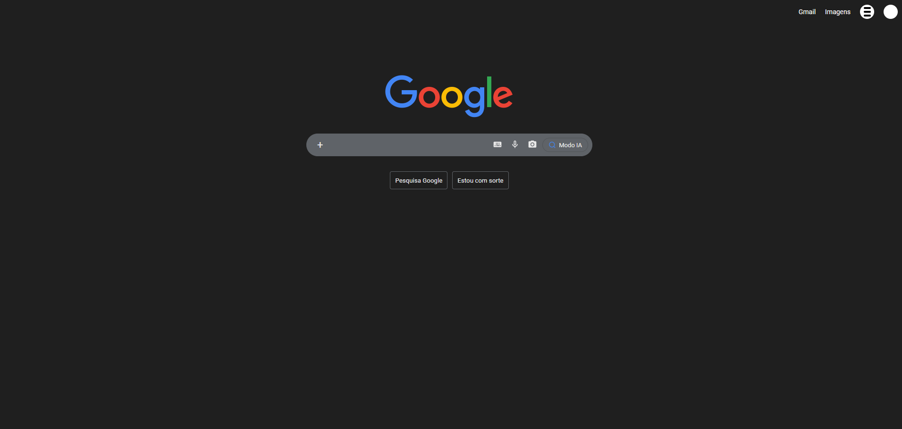
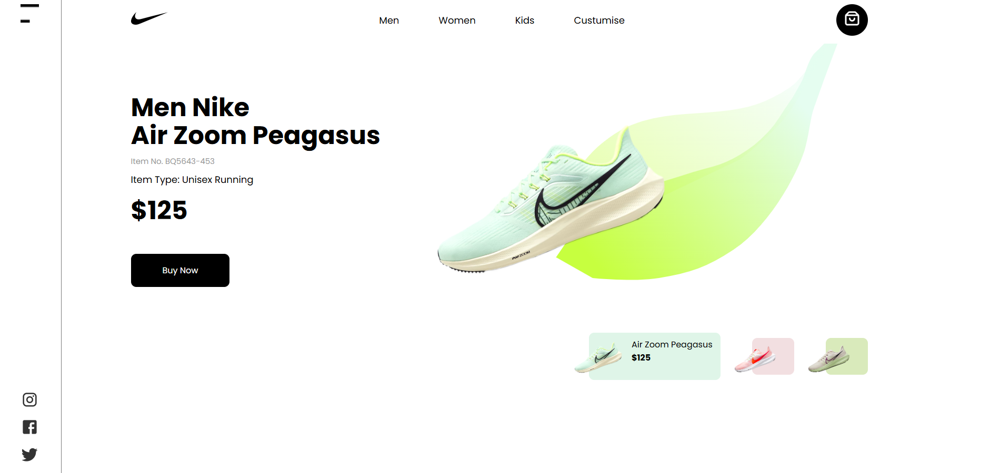
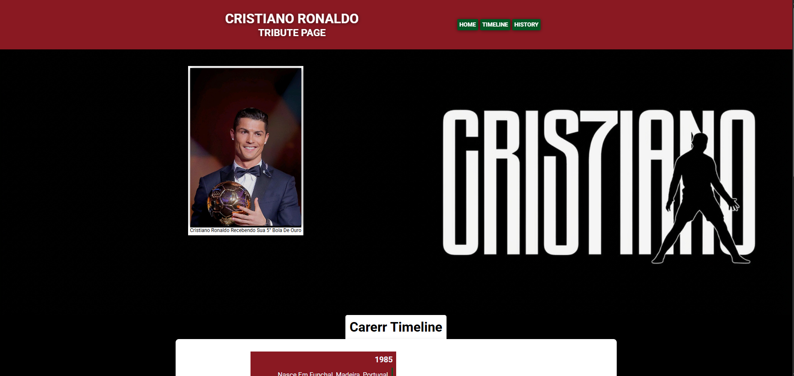

# 📚 meu-aprendizado-web

Repositório dedicado aos meus estudos de desenvolvimento web, reunindo exercícios práticos e mini-projetos desenvolvidos durante o aprendizado de HTML e CSS.

## 🗂️ Estrutura do Repositório

```
meu-aprendizado-web/
├── exercicios/
│   ├── clone google/       # Clone da página inicial do Google
│   ├── land page/          # Landing page da Nike Air Zoom Pegasus
│   ├── page formulario/    # Formulário de cadastro
│   └── page tribute/       # Tribute page do Cristiano Ronaldo
├── animações/
├── citações/
├── flexbox/
├── listas de descrição/
├── meta tag/
├── placeholder/
├── projeto-flex-box/
├── responsividade/
├── seletor pelo atributo/
├── seletor primira letra/
├── tag Figure/
├── tag main/
├── transições/
├── variaves/
└── wordwrap/
```

## 🚀 Projetos em Destaque

### 🔍 Clone Google
Recriação da página inicial do Google com dark mode, incluindo barra de pesquisa e layout fiel ao original.



---

### 👟 Nike Air Zoom Pegasus — Landing Page
Landing page de produto com design limpo, navbar, seletor de variações de cor e call-to-action.



---

### 📋 Page Formulário
Formulário de cadastro completo com campos de dados pessoais (nome, RG, CPF, filiação, contato) e layout responsivo em duas colunas.


---

### ⚽ Cristiano Ronaldo — Tribute Page
Página de tributo ao CR7 com timeline de carreira, header temático e identidade visual personalizada.



---

## 🛠️ Tecnologias Utilizadas


- HTML5 semântico
- CSS3 (Flexbox, variáveis, seletores, animações, transições)
- Responsividade

## 👨‍💻 Autor

Feito por [Bruno Silva](https://github.com/Bruno-Silva26) durante os estudos de desenvolvimento frontend.